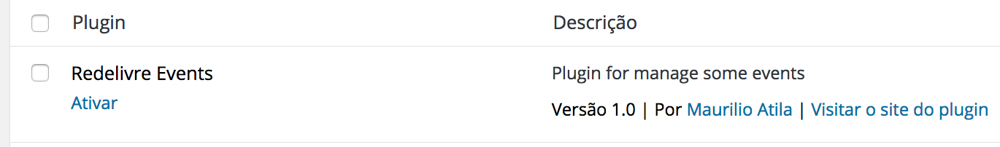
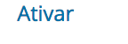
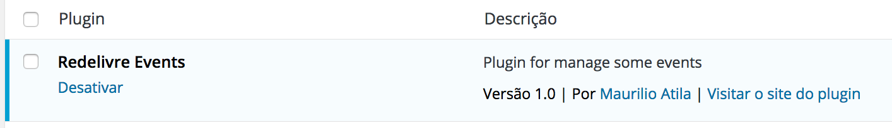
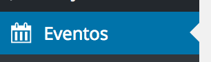
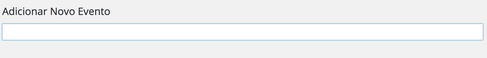
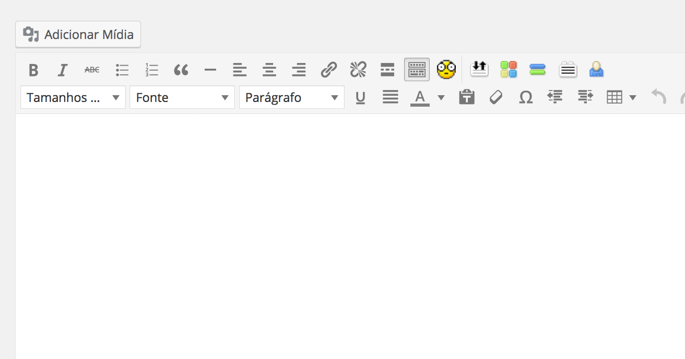
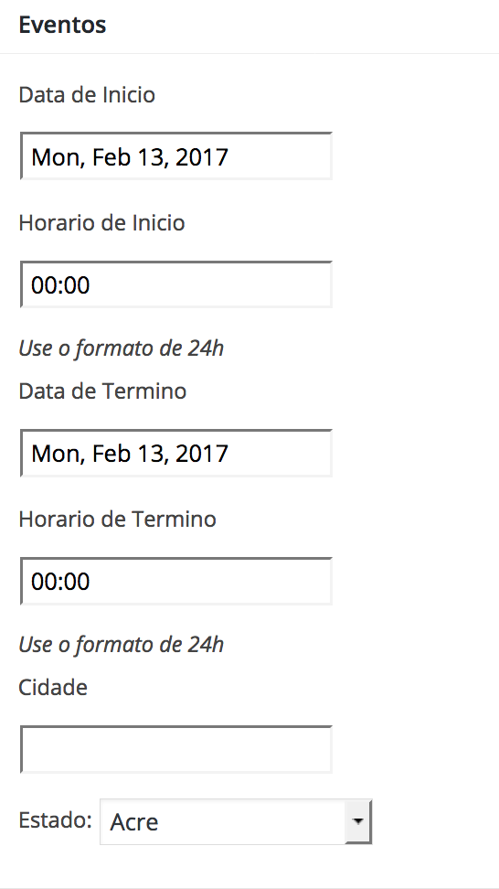

# busca
O sistema de eventos é uma demando do media ninja junto a rede livre. Para criar eventos em todo o pais. Temos um plugin MVP que implementa o mínimo para o inicio do projeto.

## Instalação 

Para instalar o modulo de eventos basta colocar ele na pasta de plugins da sua instalação da redelivre como em todo sistema Wordpress. Note que se você estiver usando o site da da redelivre para fazer seu projeto basta habilitar o modulo e começar a usar:

Procure pelo plugin na lista de plugins. Você deve encontrar algo do tipo:

Para ativar apenas clique no link:

Pronto se você ver isso que esta abaixo seu plugin já esta ativado:

## Criando seus eventos
Procure no menu lateral esquerdo por este ícone com a etiqueta “Eventos”:

Clique nele e adicione um evento da mesma forma que quando você adiciona um post. 

Adicionando o titulo:

E o corpo:

A diferença esta é que existem alguns campos diferentes em nosso tipo de conteúdo evento:

Basta preencher data/horario de inicio, de final cidade e estado. E pronto você passa a ter um evento no calendário.