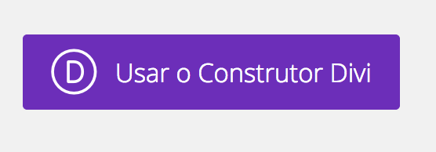
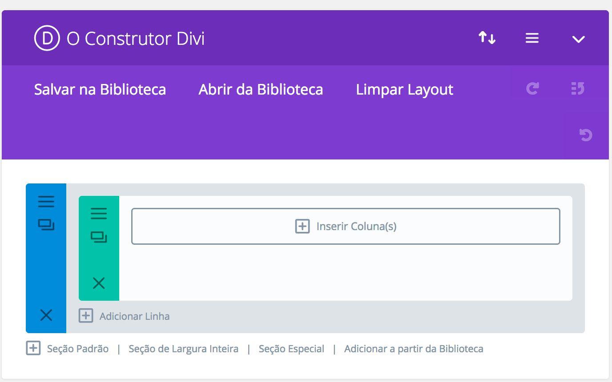
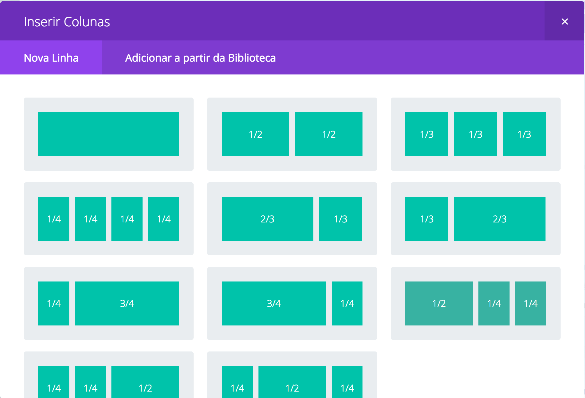
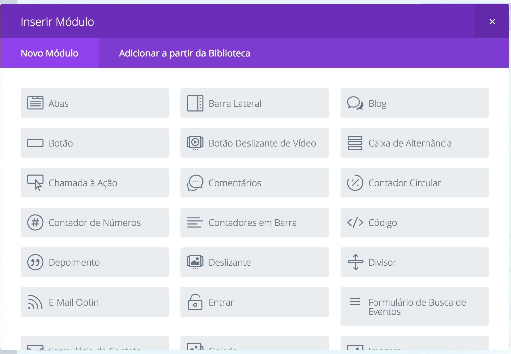
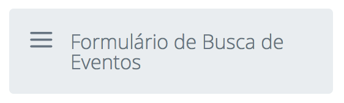
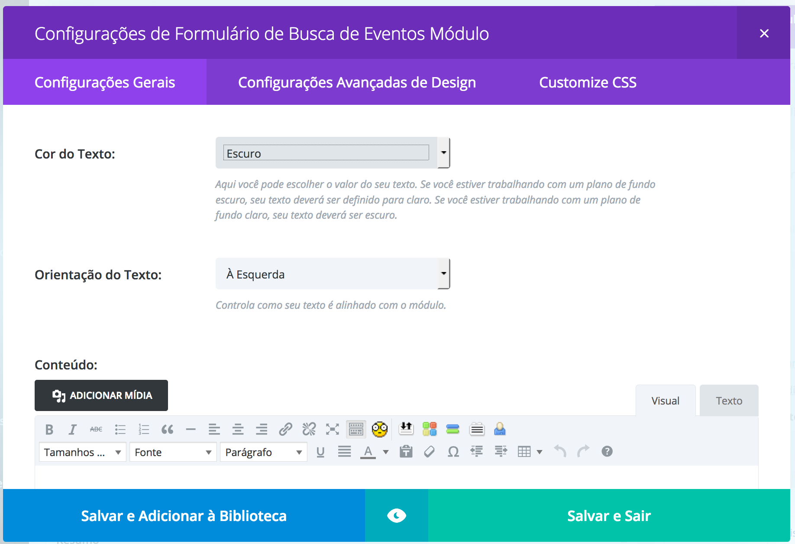

# eventos
O sistema de busca de eventos foi pensando como um modulo do tema divi por isso ele apenas funciona se você estiver com o divi instalado em seu projeto.

https://www.elegantthemes.com/gallery/divi/

## Como ativar a busca em uma página com o Divi Builder

É muito simples ativar a busca. Ao inserir um post ou uma página você deve ativar o divi builder apertando o seguinte botão:

A partir disso você passa a ter acesso a este painel do divi (o builder) um construtor que permite adicionar vários modelos inclusive o nosso.

Antes de adicionar o seu primeiro modulo você precisa adicionar uma ou mais colunas, aperte onde diz Inserir Coluna(s).

Vai aparecer para você uma caixa como esta:

Escolha o numero de colunas que você quer. Depois a frase onde dia Inserir Coluna(s) deve mudar para Inserir Modulo(s). Clique ai para ver uma lista de modulos como essa:

Note que o modulo que queremos ativar é este aqui:

Ao selecionar ele você deve ver esta caixa de configuração do modulo. 

Não se preocupe com ela. Apenas clique em Salvar e Sair. Pronto você acaba de colocar para funcionar o sistema de busca de eventos em sua página.

